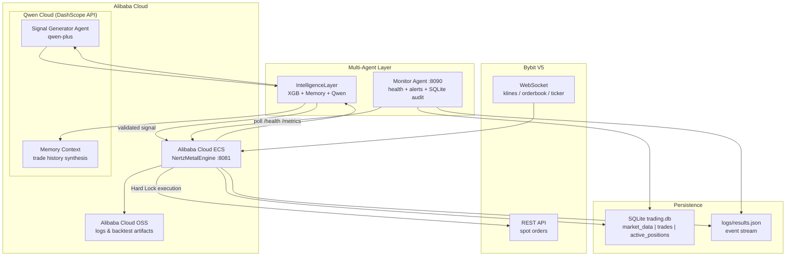
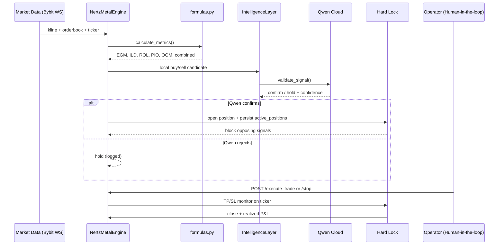

# NertzMetalEngine — Architecture Diagram

> **Hackathon:** Global AI Hackathon Series with Qwen Cloud  
> **Track:** Track 4 — Autopilot Agent  
> **Team:** NerT_dev

## System Overview

## Autopilot Workflow (Track 4)

## Proof of Alibaba Cloud Deployment

| Evidence | Location |
|----------|----------|
| DashScope API integration | `scripts/intelligence.py`, `scripts/qwen_agent.py` |
| ECS deployment guide | `docs/qwen-integration.md` |
| Architecture reference | `docs/architecture-diagram.md` (this file) |
| Monitor agent (production ops) | `monitor_agent.py` |
| Open-source repo | https://github.com/nerthzbyt/nertz-metal-engine |

Record a short screen capture showing:

1. ECS instance running `python -m scripts.nertz`
2. `GET /health` returning `qwen_configured: true`
3. DashScope console with API usage